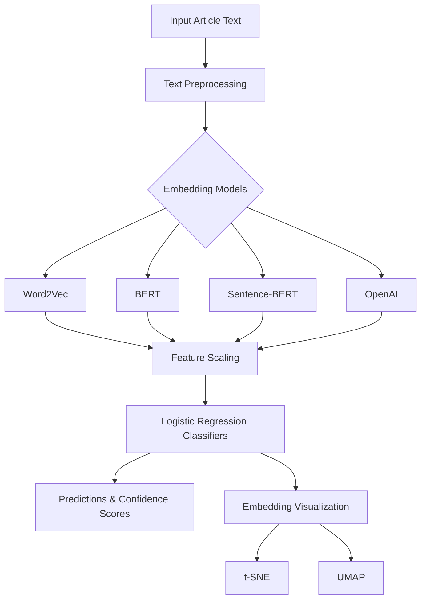

# Smart Article Categorizer

A sophisticated article classification system that leverages multiple embedding approaches to categorize articles into six distinct categories. The system employs various state-of-the-art embedding models and provides real-time visualization of classification results through an interactive Streamlit interface.

## Features

- **Multiple Embedding Models:**
  - Word2Vec/GloVe: Uses pre-trained Google News vectors (300 dimensions)
  - BERT: Utilizes [CLS] token embeddings from bert-base-uncased (768 dimensions)
  - Sentence-BERT: Implements all-MiniLM-L6-v2 model (384 dimensions)
  - OpenAI: Leverages text-embedding-ada-002 API (1536 dimensions)

- **Classification Categories:**
  - Tech
  - Finance
  - Healthcare
  - Sports
  - Politics
  - Entertainment

- **Interactive UI Features:**
  - Real-time text classification
  - Confidence scores visualization
  - Embedding space visualization using t-SNE and UMAP
  - Model performance comparison

## Project Structure

```
smart-article-categorizer/
├── app.py                 # Main Streamlit application
├── requirements.txt       # Project dependencies
├── .env                  # Environment variables (API keys)
├── README.md             # Project documentation
├── data/                 # Data storage directory
├── notebooks/            # Analysis notebooks
└── src/                  # Source code
    ├── embeddings/       # Embedding model implementations
    │   ├── __init__.py
    │   ├── base_embedder.py
    │   ├── word2vec_embedder.py
    │   ├── bert_embedder.py
    │   ├── sentence_bert_embedder.py
    │   └── openai_embedder.py
    ├── models/           # Classification models
    │   ├── __init__.py
    │   └── classifier.py
    ├── utils/            # Utility functions
    │   ├── __init__.py
    │   └── text_preprocessing.py
    └── evaluation/       # Evaluation metrics
        └── __init__.py
```

## System Architecture

The following diagram illustrates the flow of execution in the system:



## Embedding Models Details

### 1. Word2Vec
- **Model**: Google News pre-trained vectors
- **Dimension**: 300
- **Approach**: Average word vectors for document representation
- **Best for**: Capturing word-level semantics and relationships

### 2. BERT
- **Model**: bert-base-uncased
- **Dimension**: 768
- **Approach**: [CLS] token embedding from the last hidden state
- **Best for**: Understanding context and word relationships

### 3. Sentence-BERT
- **Model**: all-MiniLM-L6-v2
- **Dimension**: 384
- **Approach**: Direct sentence embeddings
- **Best for**: Efficient sentence-level semantic similarity

### 4. OpenAI
- **Model**: text-embedding-ada-002
- **Dimension**: 1536
- **Approach**: State-of-the-art text embeddings
- **Best for**: High-quality semantic understanding

## Setup and Installation

1. Clone the repository:
```bash
git clone <repository-url>
cd smart-article-categorizer
```

2. Create and activate a virtual environment:
```bash
python -m venv venv
source venv/bin/activate  # On Windows: venv\Scripts\activate
```

3. Install dependencies:
```bash
pip install -r requirements.txt
```

4. Create a `.env` file with your OpenAI API key:
```
OPENAI_API_KEY=your_api_key_here
```

5. Run the application:
```bash
streamlit run app.py
```

## UI Snapshots

[To be added - Include screenshots of:]
- Main interface
- Classification results
- Confidence score visualizations
- Embedding space visualizations
- Model comparison views

## Model Performance

[To be added - Include metrics for:]
- Accuracy
- Precision
- Recall
- F1 Score
- Comparison across different embedding approaches

## Contributing

1. Fork the repository
2. Create your feature branch (`git checkout -b feature/AmazingFeature`)
3. Commit your changes (`git commit -m 'Add some AmazingFeature'`)
4. Push to the branch (`git push origin feature/AmazingFeature`)
5. Open a Pull Request

## License

This project is licensed under the MIT License - see the LICENSE file for details.

## Acknowledgments

- HuggingFace for BERT and Sentence-BERT models
- OpenAI for text embeddings API
- Google for Word2Vec pre-trained vectors
- Streamlit for the interactive UI framework 